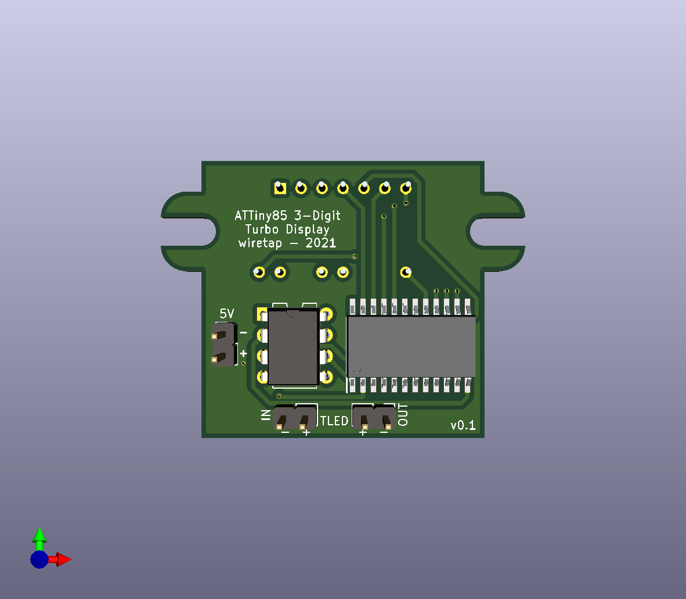

# 3-digit Turbo Display
A 3-digit turbo display for retro PC's.

\

## Info
This is a 3-digit turbo display for retro PC's. I modeled the size after one out of a case I own, so it is a standard size. It functions in the same way as my 2-digit turbo display. The design utilizes an ATTiny85 and MAX7219 chip for digit display.

## Code
No code exists yet, however the turbo.ino file from my 2-digit display can be copied, and then add the Arduino compatible MAX7219 library. 
